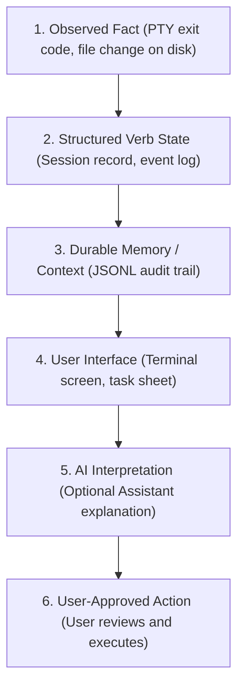

# Module 01: The Verb Philosophy and The Boundary

When people first encounter Verb running on an Android device or a desktop terminal, they often ask:
* *"Is this a new AI coding agent like Claude or Codex?"*
* *"Is this a mobile code editor like VS Code?"*
* *"Is this an AI wrapper around an API?"*

The answer to all three questions is **no**.

To understand Verb, it helps to understand the fundamental **boundary** it establishes between the tools that create code and the environment that runs them.

---

## 1. The Real-World Analogy: The Builder and the Foreman

Think of building a house:
* **The Builder (The AI Agent):** The skilled worker with the hammer and blueprint who writes the code, designs algorithms, and refactors components.
* **The Site Foreman (Verb):** The supervisor who tracks which permits are signed, makes sure safety equipment is in place, verifies that the foundation actually hardened, remembers where tools were stored when a storm hit, and helps clean up when something breaks.

In modern software development, tools like [Anthropic Claude Code](https://docs.anthropic.com/en/docs/agents-and-tools/claude-code/overview), [OpenAI Codex CLI](https://github.com/openai/codex), and [OpenCode](https://github.com/opencode-ai/opencode) are brilliant Builders. They generate code, write tests, and suggest command lines.

However, when things go wrong, developers face serious operational confusion:
* What shell commands did the agent actually run?
* Did that background process succeed or fail?
* Which folder or environment was active?
* If the app crashed or the phone rebooted, where was the agent working?
* Is it safe to undo the last step?

Verb is the Foreman. It owns the execution, environment tracking, state preservation, and recovery layer around the agent.

```text
+-------------------------------------------------------------------+
|  Claude Code  /  OpenAI Codex  /  OpenCode  /  Custom Agent       |
|  Role: Generates code, runs queries, suggests edits               |
+-------------------------------------------------------------------+
                                 |
                                 v
+-------------------------------------------------------------------+
|  VERB (The Substrate Layer)                                       |
|  * Manages real terminal processes (PTYs)                         |
|  * Captures actual command exits and directory changes            |
|  * Preserves session identity across crashes and restarts         |
|  * Explains failures using factual filesystem evidence            |
+-------------------------------------------------------------------+
```

Verb does not compete with AI agents; it gives them a durable, understandable environment to live in.

---

## 2. The Core Architecture Pipeline

Many software tools put an AI model in front of everything: the AI guesses what the computer is doing and acts on its own guesses. 

Verb strictly reverses this flow:



### The Invariant: AI Sits *After* Evidence
An AI interpretation that cannot point to a verifiable observed fact is merely a guess. Verb guarantees that:
1. Every state transition is backed by a concrete file or process event.
2. Every answer from "Ask Verb" cites the structured facts it relied upon.
3. No AI model is ever allowed to rewrite or invent historical facts.

---

## 3. The Three Golden Axioms Explained

Let us look at why Verb's three core axioms matter for all users:

### Axiom 1: `Unknown != No`
* **The Pitfall:** If a program checks whether an agent is running and cannot establish a connection, a naive program might conclude: *"The agent has finished."*
* **Verb's Approach:** If Verb loses contact with an agent because the app was force-stopped or the device rebooted, it does not invent an ending. It marks the session as `INTERRUPTED` or `UNCONFIRMED`. It only declares a session `ENDED` when it receives a verified exit code from the operating system.

### Axiom 2: `Inference != Fact`
* **The Pitfall:** An AI model reads a terminal log and asserts: *"The test failed because the port was occupied."*
* **Verb's Approach:** That is an inference, not an observed event. Verb records only what occurred (e.g., `exit_code: 1`, `duration_ms: 350`). The explanation is presented in an assistant card that explicitly links to `exit_code: 1` as evidence.

### Axiom 3: `Agent claim != Verified execution`
* **The Pitfall:** An agent prints to the screen: *"I have created `src/auth.ts`."*
* **Verb's Approach:** Verb does not take the agent's text output at face value. It checks [Git](https://git-scm.com/) status or reads the filesystem to verify whether `src/auth.ts` exists on disk.

---

## 4. Open-Source Foundations
* [The Unix Philosophy (Doug McIlroy)](https://en.wikipedia.org/wiki/Unix_philosophy): Write programs that do one thing well and work together through clean text and stream interfaces.
* [Git Version Control System](https://git-scm.com/): The industry standard for tracking code modifications and working tree changes.

---

## 5. Key Takeaways

* **Verb is a host and supervisor**, not a code generator or IDE.
* **Separation of concerns:** The agent generates solutions; Verb tracks physical execution and state.
* **Facts first:** Events are captured structurally before any AI model is consulted.

---

Next: **[Module 02: Session Lifecycle and Recovery](02_session_lifecycle_and_truth.md)** explores how Verb preserves work across process death.
