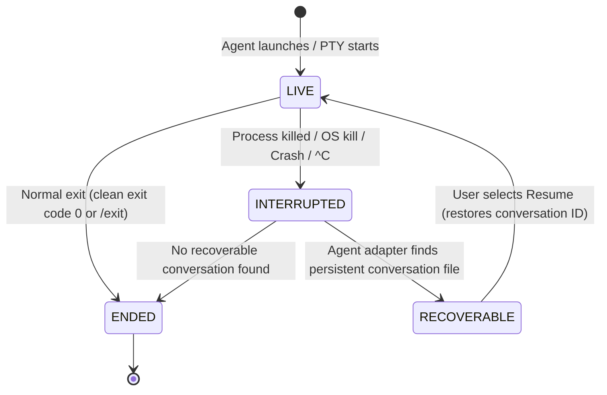

# Module 02: Session Lifecycle and Recovery

A major frustration in modern software development is **lost state**.

Consider running a multi-step task on your laptop or mobile device:
* The operating system terminates the app in the background to reclaim RAM.
* The battery runs out, or the device restarts.
* You accidentally close your terminal window.

In standard terminal emulators, your session is immediately gone. You must start over from scratch, re-open your directories, and re-explain your context.

Verb solves this problem with its **Durable Session Contract**.

---

## 1. The 4-State Session Lifecycle

Every agent and shell session inside Verb follows a single, deterministic lifecycle state machine:



### The 4 States Defined:

| State | What It Means | How It Is Observed |
| :--- | :--- | :--- |
| `LIVE` | The agent process is actively running and attached to its PTY. | Process handle is alive and streaming standard input and output. |
| `INTERRUPTED` | The process stopped unexpectedly (crash, force-stop, system reboot). | The PTY closed without a normal exit handshake, or the app restarted while state was marked running. |
| `RECOVERABLE` | Physical evidence exists on disk that allows resuming this exact conversation. | The agent adapter found saved conversation files or rollout logs on the local filesystem. |
| `ENDED` | The session completed its work and cleanly terminated. | The child process emitted a verified exit code. |

---

## 2. Why Verb Never Stores Process IDs (PIDs)

Traditional operating systems track tasks by a Process ID (`PID`), such as `PID 4821`.

Why does Verb **never** store a PID in its persistent session database?

1. **PIDs are recycled by the operating system:** If your device reboots, PID 4821 might now belong to a background system service or a browser tab. Relying on saved PIDs creates dangerous misidentification bugs.
2. **PIDs carry no semantic identity:** A PID does not know which Git repository you were working on, which branch was active, or which conversation thread the agent was in.

Instead, Verb assigns every session a **cryptographically random UUID** (`VerbSession.id`), and links it to the **agent's own persistent conversation identifier**:

```json
{
  "schema_version": 1,
  "session_id": "8f3b2190-e4a1-432d-94bb-4e6f9812a104",
  "project_id": "proj-auth-backend",
  "agent": "claude",
  "state": "RECOVERABLE",
  "resume_target": "session_01U6xSZeBmq2xsyS4FHBQhPz",
  "working_directory": "/data/data/com.aistudio.verb.app/files/home/projects/auth-backend",
  "created_at": "2026-08-30T01:15:00Z",
  "updated_at": "2026-08-30T01:22:30Z"
}
```

---

## 3. Step-by-Step Crash Recovery Walkthrough

Here is what happens under the hood when your mobile operating system terminates Verb while running Claude Code:

```text
Step 1: User launches Claude Code.
        Verb generates Session UUID '8f3b2190...'.
        Claude initializes Conversation ID 'session_01U6x...'.
        State: LIVE.

Step 2: Operating system terminates Verb's background process to save power.

Step 3: User re-opens Verb.
        1. Verb reads its persistent session ledger: last known state was LIVE.
        2. Verb checks whether the active PTY process exists (it does not).
        3. Verb marks session state as INTERRUPTED.
        4. ClaudeAgentAdapter inspects ~/.claude/sessions for 'session_01U6x...'.
        5. Adapter finds the verified JSON transcript file on disk.
        6. State transitions to RECOVERABLE.
        7. The Verb UI displays: "Claude Code - Session recoverable [Resume]".

Step 4: User taps [Resume].
        Verb launches: 'claude --resume session_01U6x...'
        Claude restores all previous conversation turns and file context.
        State transitions back to LIVE.
```

---

## 4. Open-Source References
* [UUID RFC 4122 Standard](https://datatracker.ietf.org/doc/html/rfc4122): The standard specification for universally unique identifiers.
* [JSON Schema Standard](https://json-schema.org/): For structuring deterministic and validated state definitions.

---

## 5. Key Takeaways

* **Universal state model:** All tools (Claude, Codex, OpenCode, and Shell) follow the same 4 lifecycle states.
* **No volatile IDs:** Sessions are identified by durable UUIDs and native conversation tokens, not fragile operating system PIDs.
* **Resilience across reboots:** Work is safely recoverable even after catastrophic process termination.

---

Next: **[Module 03: The PTY Engine and Multi-Terminal Isolation](03_multi_terminal_and_pty_engine.md)** explores how interactive terminals work across Android and Desktop.
