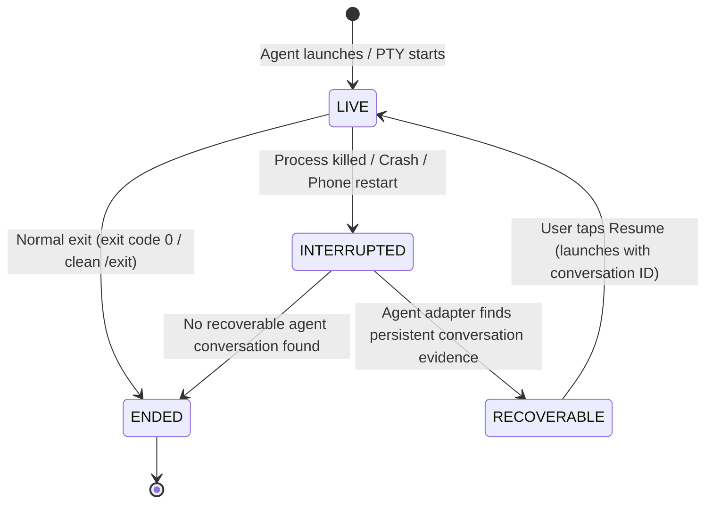

# Module 02: Session Lifecycle & Recovery

One of the biggest frustrations in terminal-based AI development is **ephemeral state**.

You are running a 20-minute agent task on your phone or laptop. Suddenly:
* The operating system kills the app to free memory.
* You accidentally swipe away the app or close your terminal.
* Your battery runs out and your machine restarts.

In a conventional terminal emulator, your session is gone forever. You have to start over from scratch and re-explain your entire context.

Verb solves this with its **Durable Session Contract**.

---

## 1. The 4-State Session Contract

Every agent and shell session inside Verb follows a single, mathematically rigorous lifecycle state machine:



### The 4 States Defined:

| State | What it means | How it is observed |
| :--- | :--- | :--- |
| `LIVE` | The agent process is actively running and attached to its PTY. | Process handle is alive and streaming I/O. |
| `INTERRUPTED` | The process abruptly stopped (crash, force-stop, OS kill, `^C`). | The PTY closed unexpectedly or the app restarted while state was marked active. |
| `RECOVERABLE` | Ground-truth evidence exists on disk that allows resuming this exact work. | The agent's adapter observed conversation records on the filesystem. |
| `ENDED` | The session completed its work and cleanly exited. | Clean exit code received from the child process. |

---

## 2. Why Verb Never Persists PIDs

In traditional operating system utilities, a running task is tracked by its Process ID (`PID`), for example `PID 14920`.

Why does Verb **never** store a PID in durable session records?

1. **PIDs are recycled:** When your phone reboots, PID 14920 might belong to a system camera service or a music player. Trusting a persisted PID leads to dangerous bugs.
2. **PIDs convey no semantic identity:** A PID does not know which project was being edited, which branch was active, or which conversation thread the agent was in.

Instead, Verb assigns every session a **cryptographically random UUID** (`VerbSession.id`), and links it to the **agent's own native conversation identifier**:

```json
{
  "schema_version": 1,
  "session_id": "8f3b2190-e4a1-432d-94bb-4e6f9812a104",
  "project_id": "proj-auth-backend",
  "agent": "claude",
  "state": "RECOVERABLE",
  "resume_target": "session_01U6xSZeBmq2xsyS4FHBQhPz",
  "working_directory": "/data/data/com.aistudio.verb.app/files/home/projects/auth-backend",
  "created_at": "2026-08-30T01:15:00Z",
  "updated_at": "2026-08-30T01:22:30Z"
}
```

---

## 3. The Recovery Flow: A Real Example

Here is what happens under the hood when your phone kills Verb while running Claude Code:

```text
Time 0:00 - User launches Claude Code. Verb assigns session UUID '8f3b...'.
            Claude generates conversation ID 'session_01U6x...'.
            State = LIVE.

Time 0:05 - Android OS runs low on RAM and kills Verb's background process.

Time 0:10 - User re-opens Verb.
            1. Verb reads its durable session record: last known state was LIVE.
            2. Verb checks if the PTY process still exists (it does not).
            3. Verb transitions session state to INTERRUPTED.
            4. ClaudeAgentAdapter scans ~/.claude/sessions for 'session_01U6x...'.
            5. Adapter finds the saved rollout file with valid turn history.
            6. State transitions to RECOVERABLE.
            7. UI displays: "Claude Code — Session recoverable [Resume]".

Time 0:15 - User taps [Resume].
            Verb launches: 'claude --resume session_01U6x...'
            Claude restores all previous conversation turns and context.
            State returns to LIVE.
```

---

## 4. Key Takeaways

* **One state machine for all tools:** Claude, Codex, and OpenCode all share the same 4 lifecycle states.
* **No ephemeral identifiers:** Verb tracks durable session UUIDs and agent conversation IDs, never fragile PIDs.
* **Resilience by default:** When a crash happens, Verb reconciles truth from disk rather than assuming work is lost.

---

Next: **[Module 03: The PTY Engine & Multi-Terminal Isolation](03_multi_terminal_and_pty_engine.md)** dives into how pseudoterminals and isolated terminal tabs work.
