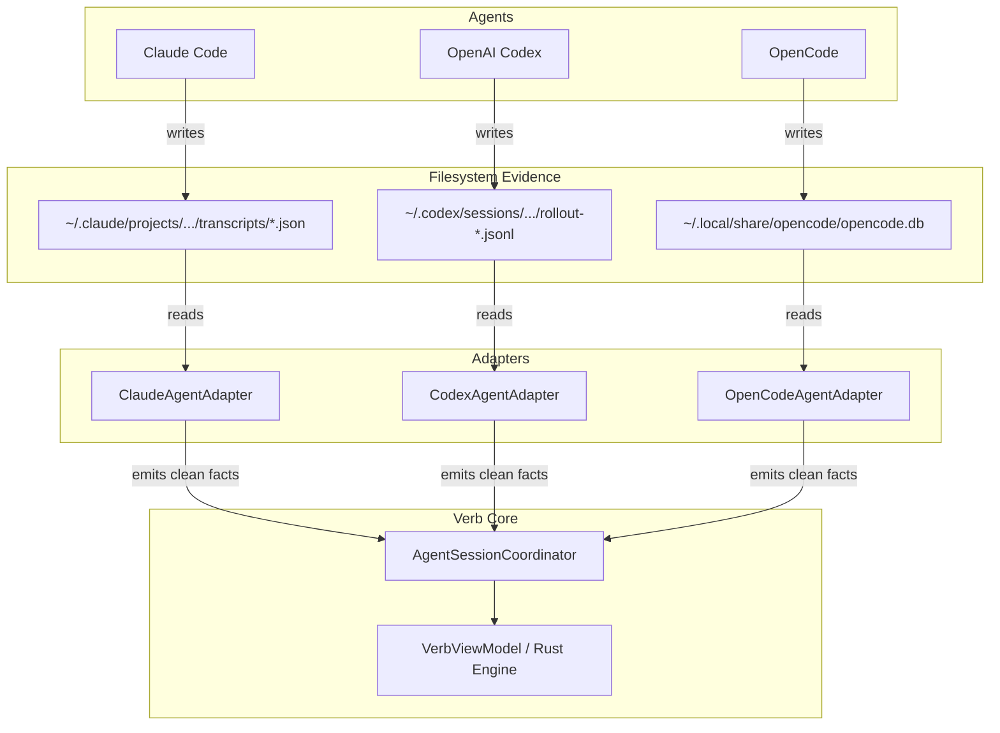

# Module 04: Agent Adapters: Observing Without Spying

How does Verb know whether Claude Code is thinking, waiting for input, or finished?
How does it know which conversation ID OpenAI Codex is using?

A naive approach would be **screen scraping**: reading the terminal output text and using regular expressions to search for phrases like `"Waiting for prompt..."` or `"Exiting..."`.

Screen scraping is notoriously fragile. If an agent changes its color scheme, updates its ASCII art banner, or fixes a typo in a message, regex parsing immediately breaks.

Verb uses a much more robust architecture: **Agent Adapters**.

---

## 1. The Adapter Pattern

Instead of guessing from terminal pixels, Verb uses small, dedicated **Agent Adapters** (`AgentAdapter` contract).

Each adapter is written specifically for one CLI tool. It knows where that tool stores its durable on-disk files and reads the tool's *own structured evidence*:



---

## 2. How Each Adapter Works

Let's look at the actual storage mechanisms used by the three primary agents:

### 1. Claude Code (`ClaudeAgentAdapter.kt` / `desktop/src/agents.rs`)
* **Where it writes:** `~/.claude/sessions/` and project transcript directories.
* **Evidence read:** Claude writes JSON transcript files that record the current conversation UUID, tool execution events, and turn timestamps.
* **How Verb resumes:** Verb extracts the active conversation UUID from the newest transcript and launches:
  ```bash
  claude --resume <conversation-id>
  ```

### 2. OpenAI Codex CLI (`CodexAgentAdapter.kt` / `desktop/src/agents.rs`)
* **Where it writes:** `~/.codex/sessions/` in rollout JSONL files.
* **Evidence read:** Codex appends JSON lines for every prompt, tool call, and token completion.
* **How Verb resumes:** Verb reads the last rollout session key and launches:
  ```bash
  codex resume <session-key>
  ```

### 3. OpenCode (`OpenCodeAgentAdapter.kt` / `desktop/src/agents.rs`)
* **Where it writes:** SQLite database in `~/.local/share/opencode/opencode.db`.
* **Evidence read:** OpenCode records sessions, messages, and model configurations directly into relational SQLite tables.
* **How Verb resumes:** Verb queries the SQLite database for the latest `session_id` associated with the project directory.

---

## 3. Adding New Agents Without Changing Core Logic

Because of this separation, adding support for a new AI tool (e.g., a new local open-source agent) **never requires changing Verb's state machine or UI logic**.

To support a new agent `XYZ`:
1. Implement `AgentAdapter` (or `desktop/src/agents.rs` trait).
2. Write a single function that inspects where `XYZ` stores its conversation IDs.
3. Define the resume CLI flag (e.g., `xyz --continue <id>`).

The entire rest of Verb—PTY hosting, multi-terminal switching, crash recovery, Working World backup, and diagnostic logging—works automatically!

---

## 4. Key Takeaways

* **No fragile screen scraping:** Verb relies on verifiable on-disk structured files written by the agents themselves.
* **Agent-native recovery:** Resuming an interrupted agent uses the agent's own first-party resume mechanisms.
* **Extensible architecture:** Supporting new agents requires only adding a small file-reading adapter.

---

Next: **[Module 05: Privacy, Continuity & Context](05_privacy_continuity_and_context.md)** explores how Verb protects your privacy while enabling cross-device sync.
