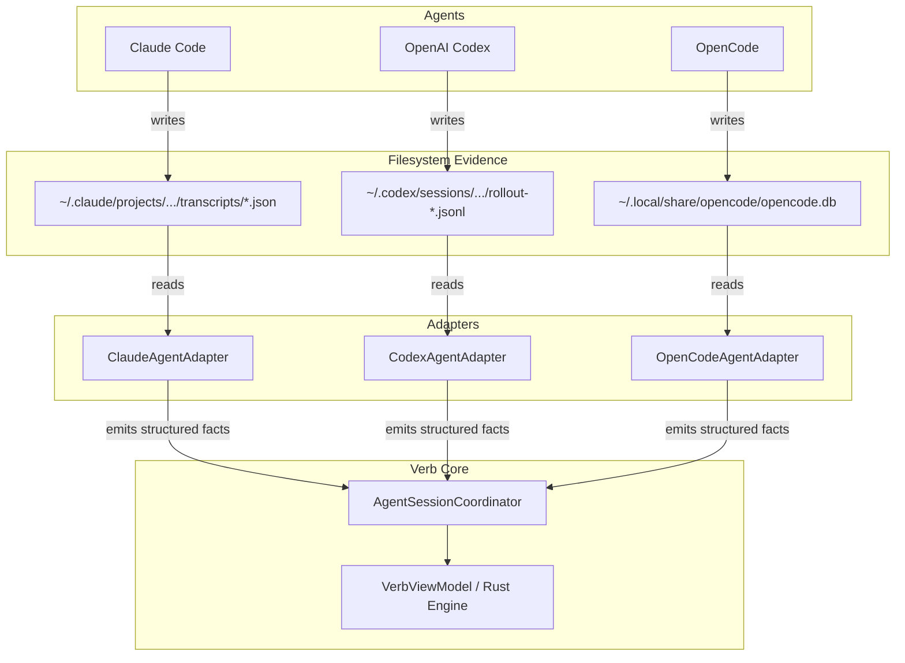

# Module 04: Agent Adapters: Observing Without Spying

How does Verb know whether an agent is actively thinking, waiting for user input, or finished?
How does Verb determine which conversation ID to use when resuming work?

A naive approach would be **screen scraping**: reading the terminal output text and searching for phrases like `"Waiting for prompt..."` or `"Finished task"`.

Screen scraping is notoriously fragile. If an agent updates its color palette, tweaks an ASCII art logo, or fixes a typo in its UI, screen scraping immediately breaks.

Verb uses a much cleaner, non-invasive architecture: **Agent Adapters**.

---

## 1. The Agent Adapter Pattern

Rather than inspecting pixels or raw terminal text streams, Verb uses small, dedicated **Agent Adapters** (`AgentAdapter` interface).

Each adapter is tailored to a specific CLI tool. It understands where that tool writes its persistent files on disk and reads the tool's *own structured data*:



---

## 2. How Adapters Work for Popular Tools

Let us inspect the storage mechanisms used by the primary supported tools:

### 1. Claude Code ([Anthropic Claude Code](https://docs.anthropic.com/en/docs/agents-and-tools/claude-code/overview))
* **Implementation:** `ClaudeAgentAdapter.kt` on Android, `desktop/src/agents.rs` on Desktop.
* **On-disk evidence:** Claude stores JSON transcript files containing conversation UUIDs, tool execution logs, and timestamps under `~/.claude/sessions/`.
* **Resume mechanism:** Verb extracts the active conversation UUID from the newest transcript file and launches:
  ```bash
  claude --resume <conversation-uuid>
  ```

### 2. OpenAI Codex CLI ([OpenAI Codex](https://github.com/openai/codex))
* **Implementation:** `CodexAgentAdapter.kt` on Android, `desktop/src/agents.rs` on Desktop.
* **On-disk evidence:** Codex appends JSON Lines (`.jsonl`) for each prompt, tool call, and token completion under `~/.codex/sessions/`.
* **Resume mechanism:** Verb reads the last rollout session key and launches:
  ```bash
  codex resume <session-key>
  ```

### 3. OpenCode ([OpenCode AI](https://github.com/opencode-ai/opencode))
* **Implementation:** `OpenCodeAgentAdapter.kt` on Android, `desktop/src/agents.rs` on Desktop.
* **On-disk evidence:** OpenCode stores sessions, conversation turns, and model settings in a local [SQLite](https://www.sqlite.org/) database (`~/.local/share/opencode/opencode.db`).
* **Resume mechanism:** Verb queries the SQLite database for the newest `session_id` mapped to the current working directory.

---

## 3. Adding New Agents Without Core Code Changes

Because adapters are decoupled from Verb's core lifecycle engine, adding support for a new AI tool (such as an open-source local LLM agent) **never requires changing Verb's state machine or user interface**:

To add a new agent:
1. Implement the `AgentAdapter` contract (or Rust trait).
2. Write a single function that reads the agent's on-disk configuration to discover active conversation IDs.
3. Define the tool's command-line resume flag (for example, `mytool --continue <id>`).

All remaining features (terminal emulation, crash resilience, Working World archiving, and multi-terminal management) function out of the box.

---

## 4. Related Open-Source References
* [SQLite Database Engine](https://www.sqlite.org/): The most widely deployed lightweight SQL database engine in the world.
* [JSON Lines Standard](https://jsonlines.org/): A convenient format for storing structured data that may be processed one record at a time.

---

## 5. Key Takeaways

* **No fragile screen scraping:** Verb reads structured, on-disk files produced by the tools themselves.
* **Native tool resumption:** Resuming an interrupted workflow uses the agent's own first-party resume commands.
* **Modular extensibility:** Supporting new developer tools requires only adding a small file-reading adapter.

---

Next: **[Module 05: Privacy, Continuity and Context](05_privacy_continuity_and_context.md)** explores how Verb safeguards your private code and secrets.
