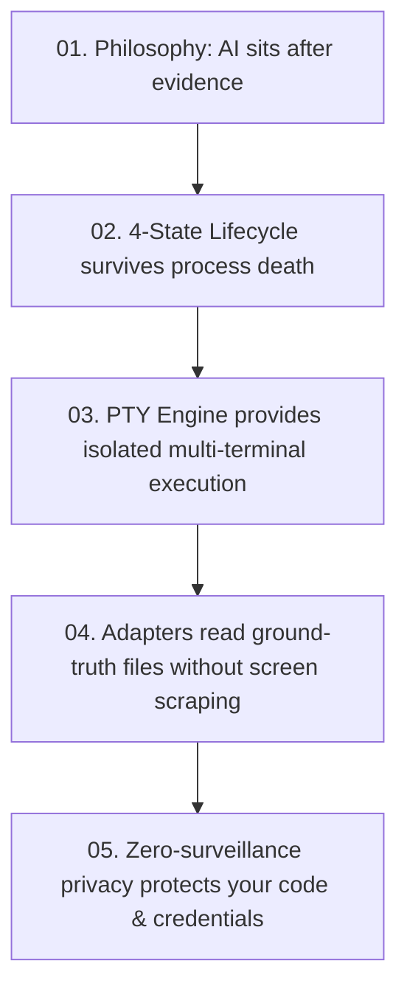

# Module 05: Privacy, Continuity & Context

Development environments contain your most sensitive data: API keys, source code, private credentials, customer data, and internal paths.

Verb is built on a foundational philosophy: **Structural memory, not surveillance.**

Let's look at how Verb handles data privacy, backup archives, cross-device continuity, and the "Ask Verb" assistant.

---

## 1. Structural Memory vs. Surveillance

Many developer tools log everything you do into a centralized database or cloud telemetry pipeline.

Verb takes the opposite approach:

| Data Type | Does Verb Persist It in Durable Records? | Why? |
| :--- | :---: | :--- |
| **Command Text** | ❌ **No** | Commands may contain inline secrets (`export GITHUB_TOKEN=ghp_...`). |
| **Terminal Output / PTY Bytes** | ❌ **No** | Output may contain database dumps, API responses, or sensitive code. |
| **User Prompts & Transcripts** | ❌ **No** | Your conversations remain owned strictly by the agent, not Verb. |
| **API Keys & Credentials** | ❌ **No** | Stored securely in Android Keystore / OS keychain, never in session files. |
| **Project Source Code** | ❌ **No** | Kept in Git; Verb never duplicates your repository trees. |
| **Session UUID & State** | ✅ **Yes** | Required to know if a session is `LIVE`, `INTERRUPTED`, or `RECOVERABLE`. |
| **Working Directory & Project Name** | ✅ **Yes** | Required to reopen the terminal in the correct project folder. |
| **Exit Codes & Timestamps** | ✅ **Yes** | Factual metadata required to detect whether a tool succeeded or failed. |

---

## 2. Working World Archives (`.vbak`)

When you want to back up your Android development setup (e.g., before switching phones), Verb provides **Working World Export/Import**:

```text
                       verb export ~/my-world.vbak
                                   │
                                   ▼
        +------------------------------------------------------+
        | Working World Archive (.vbak)                        |
        |                                                      |
        |  [X] Allowlisted CLI tool configs (~/.claude, etc.)  |
        |  [X] Verb session metadata & history                 |
        |  [X] Custom packages & shell preferences             |
        |                                                      |
        |  [!] EXCLUDES: Project git source trees              |
        |  [!] EXCLUDES: Symlinks & unsafe socket files        |
        |  [!] ENCRYPTED: AES-GCM with user-chosen passphrase  |
        +------------------------------------------------------+
```

### Safety by Construction:
* **Symlink Traversal Prevention:** Archives strictly refuse symlinks (such as `node_modules/.bin`) to prevent archive-extraction security vulnerabilities.
* **Separation from Source:** Source trees are not backed up in `.vbak` files; source code belongs in Git.

---

## 3. Cross-Device Continuity (`.vcont`)

What if you start working on your Android phone during your commute, and want to continue on your desktop when you reach your desk?

Verb uses the **Continuity Envelope (`.vcont`)**:
* An unencrypted, checksummed, human-readable JSON envelope that transfers structural project history.
* **Strict Privacy Boundary:** `.vcont` contains only session timestamps, exit codes, and durable state. It **never** carries transcripts, credentials, source files, or live process handles.
* **Evidence, Not Magic:** When you import a `.vcont` on desktop, Verb marks the imported records as **dated read-only foreign evidence**. It never pretends that a process running on your phone is magically running on your laptop.

```json
{
  "schema_version": 1,
  "exported_at": "2026-08-30T02:00:00Z",
  "source_host": "android-arm64",
  "provenance_version": "0.1.0-beta.5",
  "project_name": "verb-core",
  "sessions": [
    {
      "session_id": "8f3b2190-e4a1-432d-94bb-4e6f9812a104",
      "agent": "claude",
      "state": "RECOVERABLE",
      "created_at": "2026-08-30T01:15:00Z"
    }
  ],
  "checksum_sha256": "4a71c8..."
}
```

---

## 4. How "Ask Verb" Works Without Leaking Context

Verb includes a built-in assistant called **Ask Verb**. You can ask:
* *"Why did that command fail?"*
* *"What is the current git status?"*
* *"What did the last session do?"*

### How it protects your privacy:
When you ask a question, Verb constructs a compact **Structural Context Envelope**:
1. It includes the exit code (e.g., `exit 127`), elapsed execution time, and Git porcelain status (`M app/build.gradle.kts`).
2. It **strips** all raw terminal bytes, command strings, source code lines, credentials, and absolute system paths.
3. The LLM receives only the structural facts, answers your question, and Verb displays the exact facts used in a "Based on" panel beside the answer.

---

## 5. Summary & Graduation

Congratulations! You now understand the full architectural foundation of Verb:



You are ready to explore the codebase, contribute new adapters, or build on top of Verb's reliable session substrate!

---

* Return to the **[Documentation Index](../README.md)** or explore the **[Architecture Specification](../ARCHITECTURE.md)**.
