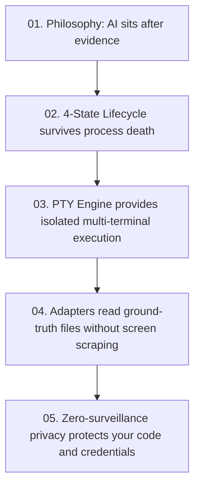

# Module 05: Privacy, Continuity and Context

Software projects contain your most critical and sensitive assets: source code, proprietary algorithms, API tokens, database passwords, and internal paths.

Verb is designed from the ground up on one principle: **Structural memory, not surveillance.**

Let us look at how Verb handles data privacy, backup archives, cross-device continuity, and the "Ask Verb" assistant.

---

## 1. Structural Memory vs. Surveillance

Many commercial developer tools log everything you type into a cloud telemetry service.

Verb takes the opposite approach:

| Information | Does Verb Persist It in Durable Records? | Reason |
| :--- | :---: | :--- |
| **Command Line Text** | **No** | Commands frequently contain passwords or secrets (`export GITHUB_TOKEN=ghp_...`). |
| **Raw Terminal Output** | **No** | Terminal output can display database queries, API payloads, or private code. |
| **Prompts and Transcripts** | **No** | Your conversations remain owned strictly by the AI agent, not Verb. |
| **API Keys and Passwords** | **No** | Stored securely in [Android Keystore](https://developer.android.com/privacy-and-security/keystore) or local secure storage, never in session files. |
| **Repository Source Code** | **No** | Managed by [Git](https://git-scm.com/); Verb never duplicates your repository trees. |
| **Session UUID and State** | **Yes** | Necessary to track whether a session is `LIVE`, `INTERRUPTED`, or `RECOVERABLE`. |
| **Working Directory Name** | **Yes** | Necessary to restore the terminal in the correct project directory. |
| **Exit Codes and Durations** | **Yes** | Factual metadata required to detect whether a command succeeded or failed. |

---

## 2. Working World Archives (`.vbak`)

When you want to back up your mobile development environment (for example, when migrating to a new phone), Verb provides **Working World Export and Import**:

```text
                       verb export ~/my-world.vbak
                                   │
                                   ▼
        +------------------------------------------------------+
        | Working World Archive (.vbak)                        |
        |                                                      |
        |  [X] Allowlisted CLI tool configs (~/.claude, etc.)  |
        |  [X] Verb session metadata and history               |
        |  [X] Custom packages and shell configurations        |
        |                                                      |
        |  [!] EXCLUDES: Project Git source trees              |
        |  [!] EXCLUDES: Symlinks and unsafe socket files      |
        |  [!] ENCRYPTED: AES-GCM with user passphrase         |
        +------------------------------------------------------+
```

### Safety Features:
* **Symlink Traversal Protection:** Archives strictly reject symbolic links (such as `node_modules/.bin`) to prevent archive-extraction directory traversal vulnerabilities.
* **Separation from Source:** Source trees are not backed up inside `.vbak` files; source code is managed via Git remotes.
* **Authenticated Encryption:** Archives are encrypted using industry-standard [AES-GCM encryption](https://en.wikipedia.org/wiki/Galois/Counter_Mode).

---

## 3. Cross-Device Continuity (`.vcont`)

If you begin working on your mobile device during a commute and want to continue on your workstation at your desk, Verb provides **Continuity Envelopes (`.vcont`)**:
* A checksummed, human-readable JSON envelope that transfers structural project history.
* **Strict Privacy Boundary:** `.vcont` contains only timestamps, exit codes, and durable state. It **never** carries transcripts, credentials, source files, or live process handles.
* **Evidence, Not Magic:** When imported on desktop, Verb marks the records as **dated read-only foreign evidence**. It never pretends that a process running on your phone is magically active on your laptop.

```json
{
  "schema_version": 1,
  "exported_at": "2026-08-30T02:00:00Z",
  "source_host": "android-arm64",
  "provenance_version": "0.1.0-beta.5",
  "project_name": "verb-core",
  "sessions": [
    {
      "session_id": "8f3b2190-e4a1-432d-94bb-4e6f9812a104",
      "agent": "claude",
      "state": "RECOVERABLE",
      "created_at": "2026-08-30T01:15:00Z"
    }
  ],
  "checksum_sha256": "4a71c853..."
}
```

---

## 4. How "Ask Verb" Works Without Leaking Data

Verb includes an assistant called **Ask Verb**. You can ask:
* *"Why did that command fail?"*
* *"What is the current Git status?"*
* *"What did the last session do?"*

### How it protects your privacy:
When you ask a question, Verb constructs a compact **Structural Context Envelope**:
1. It includes only high-level facts: the exit code (e.g., `exit 127`), elapsed execution time, and Git porcelain status (`M app/build.gradle.kts`).
2. It **strips** all raw terminal output, command arguments, source code lines, credentials, and absolute system paths.
3. The AI model receives only the structural facts, formulates an answer, and Verb renders the exact facts used in a "Based on" panel beside the response.

---

## 5. Summary and Conclusion

You now understand the complete architectural foundation of Verb:



You are ready to explore the codebase, write new adapters, or build on top of Verb's reliable session foundation.

---

## Related Open-Source References
* [AES-GCM (Galois/Counter Mode) Authenticated Encryption](https://en.wikipedia.org/wiki/Galois/Counter_Mode)
* [Android Keystore System](https://developer.android.com/privacy-and-security/keystore)
* [Git Porcelain Format](https://git-scm.com/docs/git-status#_porcelain_format_version_1)

---

* Return to the **[Documentation Index](../README.md)** or explore the **[Architecture Specification](../ARCHITECTURE.md)**.
