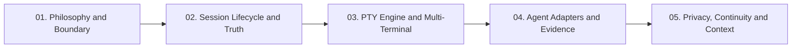

# Understanding Verb: Architecture and Concepts Explained

Welcome to the **Understanding Verb** documentation series. Whether you are a newcomer to software development discovering terminal tools for the first time, an AI practitioner curious about how agent execution works, or a systems engineer reviewing lifecycle state machines, this guide breaks down how Verb works from first principles.

Verb is built around a clear architectural rule: it is **not** a code editor (IDE), **not** an artificial intelligence model, and **not** a prompt wrapper. Instead, it is the **truth and control substrate** that hosts and coordinates the developer tools you already use.

---

## Learning Path

Follow the modules in order, or jump directly to any topic:



| Module | Title | What You Will Learn |
| :--- | :--- | :--- |
| **[01](01_the_verb_philosophy.md)** | **[The Verb Philosophy: The Boundary](01_the_verb_philosophy.md)** | Why Verb is not an IDE or Agent, the core truth axioms, and why AI sits *after* evidence. |
| **[02](02_session_lifecycle_and_truth.md)** | **[Session Lifecycle and Recovery](02_session_lifecycle_and_truth.md)** | The 4-state lifecycle state machine (`LIVE -> INTERRUPTED -> RECOVERABLE -> ENDED`), and how sessions survive process death and phone reboots without storing volatile PIDs. |
| **[03](03_multi_terminal_and_pty_engine.md)** | **[The PTY Engine and Multi-Terminal Isolation](03_multi_terminal_and_pty_engine.md)** | What pseudoterminals (PTYs) are, Android PRoot userlands, Rust native PTYs, and session-bound lifecycle isolation. |
| **[04](04_agent_adapters_and_evidence.md)** | **[Agent Adapters: Observing Without Spying](04_agent_adapters_and_evidence.md)** | How Verb extracts ground truth from Claude Code, OpenAI Codex, and OpenCode without fragile screen scraping. |
| **[05](05_privacy_continuity_and_context.md)** | **[Privacy, Continuity and Context](05_privacy_continuity_and_context.md)** | Zero-surveillance storage, `.vbak` Working World encryption, `.vcont` cross-device transport, and the "Ask Verb" engine. |

---

## The Three Golden Rules of Verb

Every line of code and architectural decision in Verb is governed by three constitutional axioms:

```text
1. Unknown != No
   Absence of evidence is never evidence of absence. If we cannot prove a fact, we mark it unknown.

2. Inference != Fact
   An AI model's guess must never be stored or presented as an observed historical event.

3. Agent claim != Verified execution
   An agent saying "I created file X" is not proof that file X exists until the filesystem verifies it.
```

---

## Related Open-Source References
* [POSIX Pseudoterminal (PTY) standard](https://en.wikipedia.org/wiki/Pseudoterminal)
* [PRoot userland virtualization](https://proot-me.github.io/)
* [Termux open-source package ecosystem](https://github.com/termux/termux-packages)
* [Ratatui terminal UI library](https://ratatui.rs/)
* [JSON Lines format specification](https://jsonlines.org/)
* [NO_COLOR accessibility standard](https://no-color.org/)

---

Next: Start reading **[Module 01: The Verb Philosophy and Boundary](01_the_verb_philosophy.md)**.
