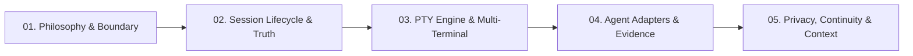

# Understanding Verb: Architecture & Concepts Explained

Welcome to the **Understanding Verb** documentation series. Whether you are a junior developer discovering terminal emulators, an AI engineer exploring autonomous agents, or a systems architect reviewing lifecycle state machines—this guide breaks down how Verb works from the ground up.

Verb is built around an unusually strict set of architectural rules. It is **not** an IDE, **not** a coding agent, and **not** a model provider. Instead, it is the **truth and control substrate** that wraps around the tools and agents you already use.

---

## 🗺️ Learning Path

Follow the guides in order, or jump directly to the topic you want to understand:



| Module | Title | What You'll Learn |
| :--- | :--- | :--- |
| **[01](01_the_verb_philosophy.md)** | **[The Verb Philosophy: The Boundary](01_the_verb_philosophy.md)** | Why Verb is not an IDE or Agent, the core truth axioms, and why AI sits *after* evidence. |
| **[02](02_session_lifecycle_and_truth.md)** | **[Session Lifecycle & Recovery](02_session_lifecycle_and_truth.md)** | The 4-state state machine (`LIVE → INTERRUPTED → RECOVERABLE → ENDED`), and how sessions survive process death and phone reboots without storing PIDs. |
| **[03](03_multi_terminal_and_pty_engine.md)** | **[The PTY Engine & Multi-Terminal Isolation](03_multi_terminal_and_pty_engine.md)** | What pseudoterminals (PTYs) are, Android proot userlands, Rust native PTYs, and session-bound lifecycle isolation. |
| **[04](04_agent_adapters_and_evidence.md)** | **[Agent Adapters: Observing Without Spying](04_agent_adapters_and_evidence.md)** | How Verb extracts ground truth from Claude Code, OpenAI Codex, and OpenCode without intercepting keystrokes or transcripts. |
| **[05](05_privacy_continuity_and_context.md)** | **[Privacy, Continuity & Context](05_privacy_continuity_and_context.md)** | Zero-surveillance storage, `.vbak` Working World encryption, `.vcont` cross-device transport, and the "Ask Verb" engine. |

---

## 💡 The Three Golden Rules of Verb

Every line of code and architectural decision in Verb is governed by three constitutional axioms:

```text
1. Unknown ≠ No
   Absence of evidence is never evidence of absence. If we cannot prove a fact, we mark it unknown.

2. Inference ≠ Fact
   An AI model's guess must never be stored or presented as an observed historical event.

3. Agent claim ≠ Verified execution
   An agent saying "I created file X" is not proof that file X exists until the filesystem verifies it.
```

---

Next: Start reading **[Module 01: The Verb Philosophy & Boundary](01_the_verb_philosophy.md)**.
